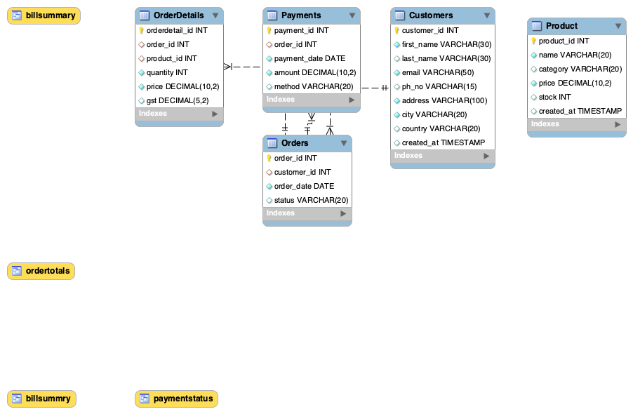

# Online Retail Database

This repository contains the SQL scripts and ER diagram for a sample Online Retail Database.

## Contents
- `retail_db.sql` → Complete database script (create schema + tables)
- `retail_db_Customers.sql` → Customers table
- `retail_db_Orders.sql` → Orders table
- `retail_db_OrderDetails.sql` → OrderDetails table
- `retail_db_Payments.sql` → Payments table
- `retail_db_Product.sql` → Products table
- `ER_RETAIL.png` → Entity-Relationship Diagram

## ER Diagram


## How to Use
1. Clone the repo  
   ```bash
   git clone https://github.com/jinesh1808/Online-Retail-DB.git
